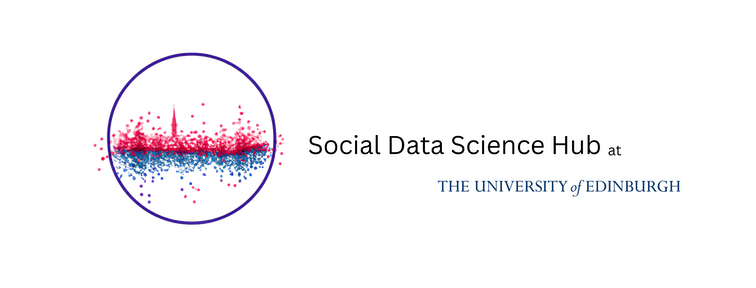

# sicss_23

Repository of materials for SICSS-Edinburgh, 2023.

# **SICSS-Edinburgh Schedule**

## Overview

- **Main Room**: Lister Learning and Teaching Centre (LLTC) Room 1.16
- **Breakout rooms**: LG.06, LG.08 & LG.09 

### Week 1

During Week 1, days are split into morning and afternoon training sessions in various computational methods. Each day then ends with a dedicated research talk.

Note that on June 15 we will be holding our official launch event for the Social Data Science Hub. We expect you all to attend and ask that you sign up [here](https://www.eventbrite.co.uk/e/social-data-science-sds-hub-launch-tickets-630675396087). This will be a chance for you to meet others working in this field, as well as our keynote speaker, Arthur Spirling from NYU. 

Given that you won't have any instruction on this day, we may hold a catch-up review session in the Monday of Week 2. 

### Week 2

During Week 2, we will be working on either:

1. Collaborative group projects selected from a list provided by instructors
2. Your own group project idea

We will provide a set of groups project ideas that have been suggested by your instructors or other members of Edinburgh Social Science/Informatics Faculty. The idea is that you work on these within your groups with advice from your instructor.

## Schedule

| Date       | Summary                         |  9am-10am  | 10am-11am      | 11am-12pm      | 12pm-1pm        | 1pm-2pm | 2pm-3pm             | 3pm-4pm                          | 4pm-5pm                          | 5pm-6pm             |
| ---------- | ------------------------------- | --------------------------------- | -------------- | -------------- | --------------- | ------- | ------------------- | -------------------------------- | -------------------------------- | ------------------- |
| 06/12/2023 | Ethics; Workflow; Intro CSS     | Welcome |        Björn Ross       | Björn Ross   | Björn Ross    | Lunch   | Chris Barrie          | Chris Barrie                       | Abdullah Almaatouq               | Abdullah Almaatouq  |
| 06/13/2023 | CTA; Scaling                    |                                    | Chris Barrie   | Chris Barrie   | Chris Barrie    | Lunch   | Ugur Ozdemir        | Ugur Ozdemir                     | Paola Tubaro                     | Paola Tubaro        |
| 06/14/2023 | Networks                        |                                   | Tod Van Gunten  | Tod Van Gunten | Tod Van Gunten  | Lunch   | Tod Van Gunten      | Tod Van Gunten                    | Alumni Panel                     | Alumni Panel        |
| 06/15/2023 |                                 |                                  | SDS-Hub Launch | SDS-Hub Launch | SDS-Hub Launch  | Lunch   | SDS-Hub Launch      | SDS-Hub Launch                   | SDS-Hub Launch                   | SDS-Hub Launch      |
| 06/16/2023 | Machine learning and prediction |                                   | Björn Ross      | Björn Ross      | Walid Magdy     | Lunch   | Walid Magdy         | Walid Magdy                      | Aybuke Atalay                    | Aybuke Atalay       |
| 06/17/2023 |                                 |                                   |                |                |                 |    |                     |                                  |                                  |                     |
| 06/18/2023 |                                 |                                   |                |                |                 |         |                     |                                  |                                  |                     |
| 06/19/2023 | Research design discussion      |                                   | Chris Barrie   | Chris Barrie   | Group formation | Lunch   | Project Work        | Project Work                     | Dilara Kekulluoglu               | Dilara Kekulluoglu  |
| 06/20/2023 | Mostly group work               |                                   | Project Work   | Project Work   | Project Work    | Lunch   | Project Work        | Project Work                     | Akin Unver                       | Akin Unver          |
 06/21/2023 | Mostly group work               |                                  | Project Work   | Project Work   | Project Work    | Lunch   | Adam Chalmers         | Project Work/Generative AI event | Project Work/Generative AI event | Project Work        |
| 06/22/2023 | Mostly group work               |                                  | Project Work   | Project Work   | Project Work    | Lunch   | Project Work        | Project Work                     | Project Work                     | Project Work        |
| 06/23/2023 | Group Presentations             |                                   | Project Work   | Project Work   | Project Work    | Lunch   | Group Presentations | Group Presentations              | Group Presentations              | Group Presentations |

### Materials

# Day 1

## General Intro., Ethics, and CSS

- Intro. slides: [here](https://raw.githack.com/cjbarrie/sicss_23/main/000_intro.html)
- Intro. APIs: [here](https://raw.githack.com/cjbarrie/sicss_23/main/01_apis.html)
- APIs worksheet: [here](https://raw.githack.com/cjbarrie/sicss_23/main/02_apis_example.html)

# Day 2

- CTA Intro.: [here](https://docs.google.com/presentation/d/e/2PACX-1vQtIyFyGG7dc_DLuNy3iI9wEmGyZfRG8qChHr56c6Bd5kWO3RRskidCslBfJBy3-RS5D3tFR_CTa7Bi/pub?start=true&loop=false&delayms=3000)
- CTA Intro. code: [here](https://raw.githack.com/cjbarrie/sicss_23/main/05_cta.html)
- CTA worksheet 1: [here](https://raw.githack.com/cjbarrie/sicss_23/main/05_cta_notebook1.html)
- CTA worksheet 2: [here](https://raw.githack.com/cjbarrie/sicss_23/main/05_cta_notebook2.html)
- Scaling script: [here](https://github.com/cjbarrie/sicss_23/blob/main/other_instructor_materials/ScalingLectureCode2023.r)
- Scaling slides: [here](https://github.com/cjbarrie/sicss_23/blob/main/other_instructor_materials/ScalingLectureSlides.pdf)

# Day 3

- Networks slides: [here](https://github.com/cjbarrie/sicss_23/blob/main/other_instructor_materials/sicss_networks_2023.pdf)
- Networks materials: [here](https://github.com/cjbarrie/sicss_23/blob/main/other_instructor_materials/mp_tweet_networks_2023_v1.R)

# Day 5

- Global analysis slides: [here](https://github.com/cjbarrie/sicss_23/blob/main/other_instructor_materials/Global_Analysis.pdf)
- Classification slides: [here](https://github.com/cjbarrie/sicss_23/blob/main/other_instructor_materials/Text_Classification.pdf)
- Prediction slides: [here](https://github.com/cjbarrie/sicss_23/blob/main/other_instructor_materials/Predicting_Attributes.pdf)
